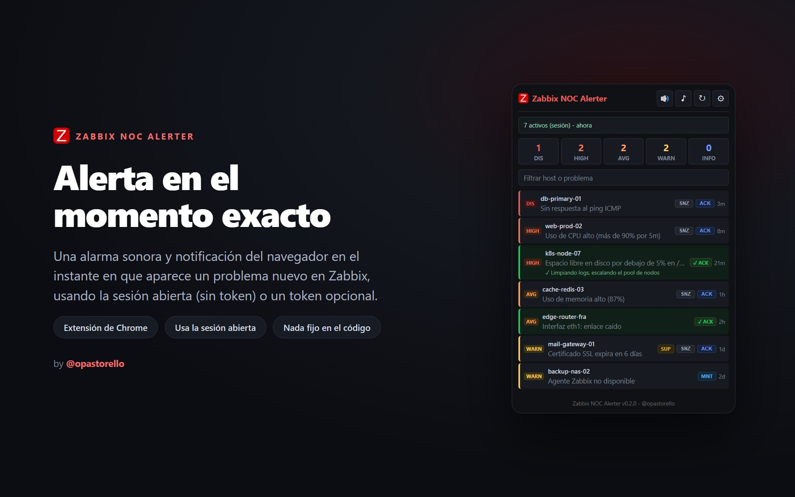
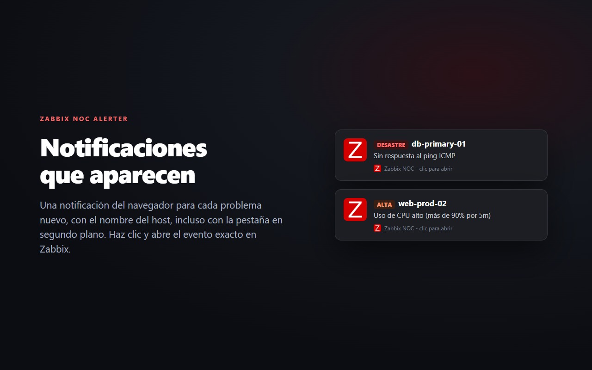
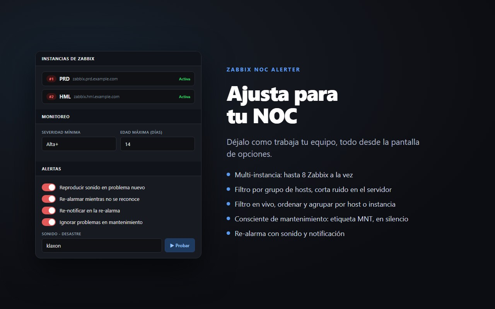
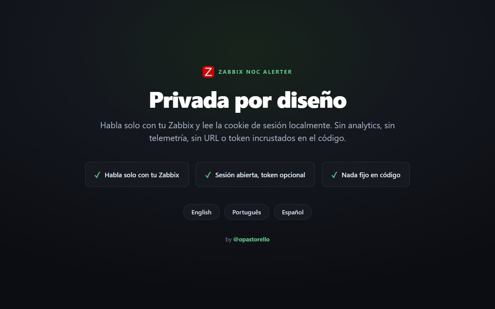

<h1 align="center">🔔 Zabbix NOC Alerter</h1>

  Una <b>alarma sonora y notificación</b> del navegador en el momento en que aparece 
  un <b>problema nuevo</b> en Zabbix, usando la sesión donde ya <b>tienes login</b>. Sin token, nada fijo en código.

  <a href="README.md">English</a> ·
  <a href="README.pt.md">Português</a> ·
  <b>Español</b>

  
  
  
  
  
  

  

Un panel que tienes que estar mirando es fácil de perder. Esta extensión convierte
un problema nuevo de Zabbix en algo imposible de ignorar: un sonido y una
notificación, en tu navegador, mientras trabajas en cualquier otra cosa.

## Funciones

- 🛰️ **Multi-instancia:** monitorea hasta 8 servidores Zabbix independientes a la vez, cada uno con su URL y autenticación; cada problema muestra una etiqueta de su instancia.
- 🔑 **Tres modos de autenticación por instancia:** sesión del navegador (sin credenciales), token de API, o usuario y contraseña (la extensión inicia sesión y la renueva sola).
- 🔊 **Sonido por severidad** con volumen y botón de prueba.
- 🔁 **Re-alarma** (sonido y notificación) mientras haya un problema no reconocido, hasta dar ack o silencio.
- 📅 **Alertar solo en horario laboral:** lee el Working time de tu servidor Zabbix y queda en silencio fuera de él (la lista y el badge siguen actualizándose).
- 🎦 **Modo reunión (Google Meet):** silencia sonidos y/o notificaciones mientras estás en una llamada de Meet.
- 🛠️ **Consciente de mantenimiento:** los problemas en ventana de mantenimiento reciben la etiqueta MNT y quedan en silencio (o los ocultas).
- 🔍 **Filtro en vivo** en el popup por host o nombre del problema, o haciendo clic en una severidad; **ordenar** y **agrupar por host o instancia**.
- 💤 **Posponer (snooze) un solo problema** (15 min a 4 h) sin el silencio global; al terminar, vuelve a avisar.
- 🖥️ **Muestra el host** (y la instancia, cuando monitoreas más de una) en la lista y en la notificación.
- ✅ **Ack desde el popup** (con mensaje) y muestra el ack existente.
- 🟢 **Notificación de resuelto** cuando un problema se recupera.
- 🖱️ **Clic en el problema** abre el evento exacto en Zabbix.
- 🔎 **Filtros:** severidad mínima, edad máxima, **grupos de hosts**, excluir por texto, ocultar suprimidos/reconocidos/en mantenimiento; badge "no vistos" opcional.
- 💾 **Backup:** exportar e importar la configuración en JSON (los tokens y contraseñas de las instancias nunca se exportan).
- 🌐 **Idiomas:** English, Português, Español, elegido automáticamente por el navegador.
- 🔒 **Nada fijo en código:** las URLs de Zabbix (y las credenciales) viven solo en las opciones.

## Instalación

### Desde la Chrome Web Store (recomendado)

[**Instalar Zabbix NOC Alerter**](https://chromewebstore.google.com/detail/zabbix-noc-alerter/nlbihmhpbdfhnglclecbaebnfpjbngep) - un clic, con actualizaciones automáticas. Luego abre las **opciones** de la extensión, agrega una instancia de Zabbix y mantén una pestaña de Zabbix con sesión iniciada. Eso es todo.

### Desde el código (unpacked)

1. Descarga el [release](https://github.com/opastorello/zabbix-noc-alerter/releases/latest) más reciente y descomprímelo (o clona este repositorio).
2. Abre `chrome://extensions`, activa el **Developer mode**, pulsa **Load unpacked** y elige la carpeta.
3. Abre las **opciones** de la extensión y agrega una instancia de Zabbix (URL y la forma de autenticación).
4. Si elegiste el modo sesión del navegador, mantén una pestaña de Zabbix con sesión iniciada. Eso es todo.

## Cómo funciona

La extensión consulta la API de Zabbix por problemas activos; un problema nuevo
reproduce un sonido y lanza una notificación. Cada instancia se autentica de una
de tres formas, elegida en las opciones:

- **Sin autenticación (sesión del navegador):** lee la cookie de sesión de la pestaña de Zabbix donde ya tienes login. Nada que configurar; solo mantén una pestaña con sesión.
- **Token de API:** un token generado en Zabbix (Usuario > Tokens de API). Funciona sin pestaña de Zabbix abierta y sobrevive al logout del frontend.
- **Usuario y contraseña:** la extensión inicia sesión en la API (`user.login`) y renueva la sesión sola cuando expira.

**Compatibilidad:** probado en Zabbix 6.0 a 7.4 (la sesión del frontend y todas las llamadas a la API funcionan). Zabbix 8.0 se validará cuando llegue a una versión estable.

## Privacidad

Habla solo con **tu Zabbix** (la URL que configuraste) y lee la cookie de sesión
localmente. Las credenciales (token o usuario/contraseña) quedan solo en tu navegador
y nunca se exportan. Sin analytics, sin telemetría, sin URL o credencial incrustada
en el código.

## Capturas de pantalla

  
    
  
    
  

## Contribuir

Issues y pull requests son bienvenidos, en especial nuevas traducciones. Mira
[CONTRIBUTING.md](CONTRIBUTING.md).

## Licencia

[MIT](LICENSE) © Nicolas Pastorello ([@opastorello](https://github.com/opastorello))
