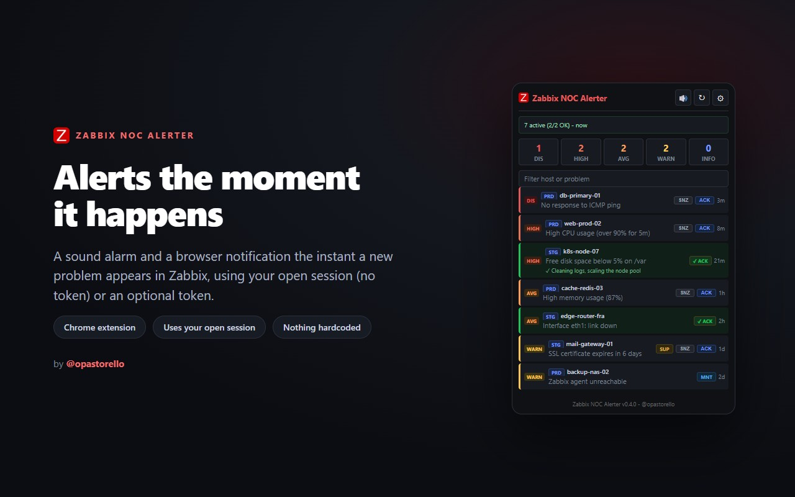
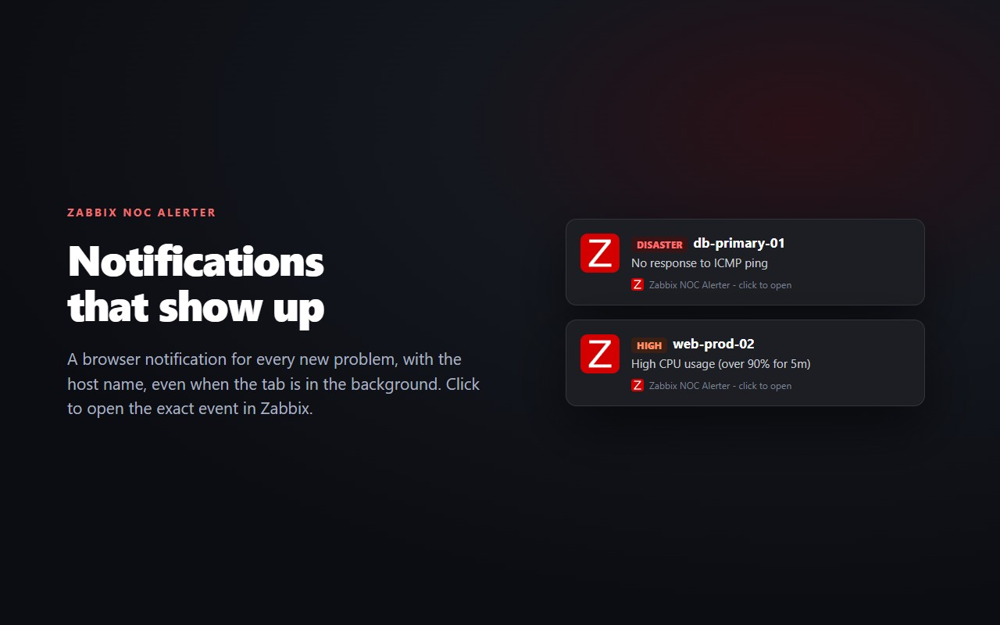
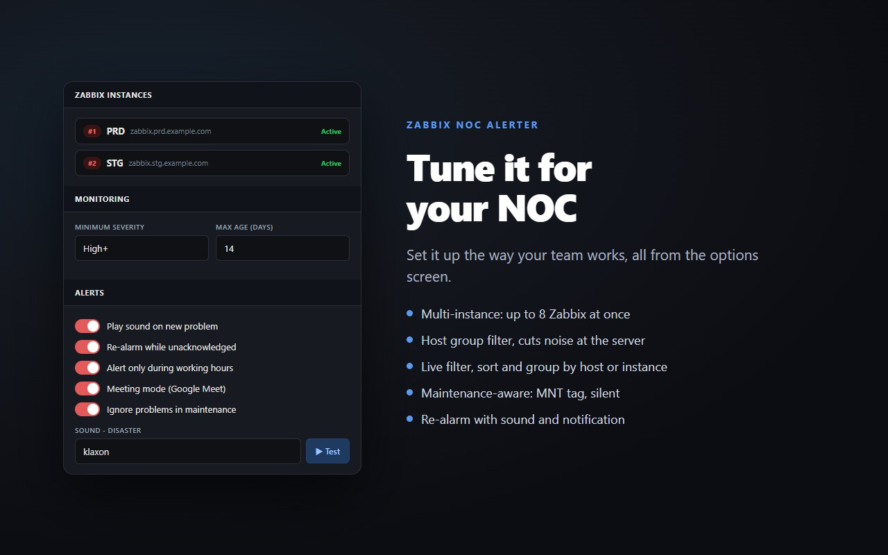
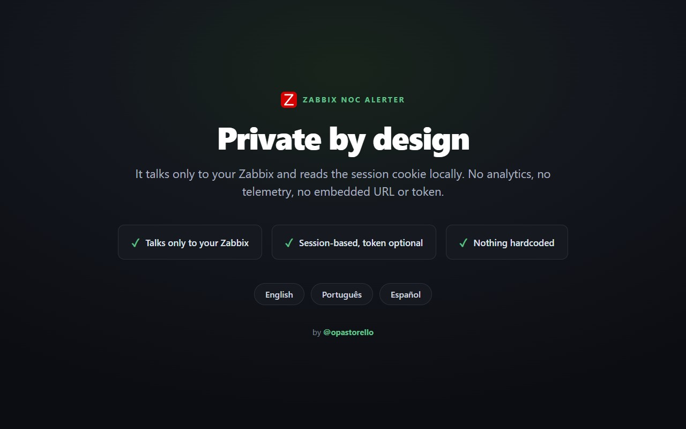

<h1 align="center">🔔 Zabbix NOC Alerter</h1>

  A <b>sound alarm and browser notification</b> the moment a <b>new Zabbix problem</b> appears, 
  using the browser session you are <b>already logged into</b>. No token, nothing hardcoded.

  <b>English</b> ·
  <a href="README.pt.md">Português</a> ·
  <a href="README.es.md">Español</a>

  
  
  
  
  
  

  

A dashboard you have to keep staring at is easy to miss. This extension turns a new
Zabbix problem into something you cannot ignore: a sound and a desktop notification,
right in your browser, while you work on anything else.

## Features

- 🛰️ **Multi-instance:** watch up to 8 independent Zabbix servers at once, each with its own URL and optional token; every problem is badged with its instance.
- 🔊 **Per-severity sound** with volume and a test button.
- 🔁 **Re-alarm** (sound and notification) while a problem is unacknowledged, until you ack it or mute.
- 📅 **Alert only during working hours:** reads the Working time from your Zabbix server and stays silent outside it (list and badge keep updating).
- 🎦 **Meeting mode (Google Meet):** silences sounds and/or notifications while you are in a Meet call.
- 🛠️ **Maintenance-aware:** problems in a maintenance window get an MNT tag and stay silent (or hide them).
- 🔍 **Live filter** in the popup by host or problem name, or by clicking a severity; **sort** and **group by host or instance**.
- 💤 **Snooze a single problem** (15 min to 4 h) without the global mute; it re-alerts when the snooze ends.
- 🖥️ **Shows the host** (and the instance, when you watch more than one) in the list and in the notification.
- ✅ **Acknowledge from the popup** (with a message), and see any existing ack.
- 🟢 **Resolved notification** when a problem recovers.
- 🖱️ **Click a problem** to open the exact event in Zabbix.
- 🔎 **Filters:** minimum severity, max age, **host groups**, exclude by text, hide suppressed/acked/in-maintenance; optional "unseen" badge.
- 💾 **Backup:** export and import settings as JSON (instance tokens are never exported).
- 🌐 **Languages:** English, Português, Español, picked automatically from your browser.
- 🔒 **Nothing hardcoded:** the Zabbix URLs (and optional tokens) live only in the options.

## Install

### From the Chrome Web Store (recommended)

[**Install Zabbix NOC Alerter**](https://chromewebstore.google.com/detail/zabbix-noc-alerter/nlbihmhpbdfhnglclecbaebnfpjbngep) - one click, with automatic updates. Then open the extension **options**, add a Zabbix instance, and keep a Zabbix tab logged in. That is all.

### From source (unpacked)

1. Download the latest [release](https://github.com/opastorello/zabbix-noc-alerter/releases/latest) and unzip it (or clone this repo).
2. Open `chrome://extensions`, turn on **Developer mode**, click **Load unpacked** and pick the folder.
3. Open the extension **options** and add a Zabbix instance (URL, optional token).
4. Keep a Zabbix tab logged in. That is all.

## How it works

The extension reads the session cookie of the Zabbix tab you are already logged into
and polls the Zabbix API for active problems. A new one plays a sound and raises a
notification. No token is required; if your Zabbix does not accept the frontend
session for API writes (acknowledge), set an API token in the options as a fallback.

**Compatibility:** tested on Zabbix 6.0 to 7.4 (frontend session and all API calls work). Zabbix 8.0 will be validated once it reaches a stable release.

## Privacy

Talks only to **your Zabbix** (the URL you set) and reads its session cookie locally.
No analytics, no telemetry, no embedded URL or token.

## Screenshots

  
    
  
    
  

## Contributing

Issues and pull requests are welcome, especially new translations. See
[CONTRIBUTING.md](CONTRIBUTING.md).

## License

[MIT](LICENSE) © Nicolas Pastorello ([@opastorello](https://github.com/opastorello))
