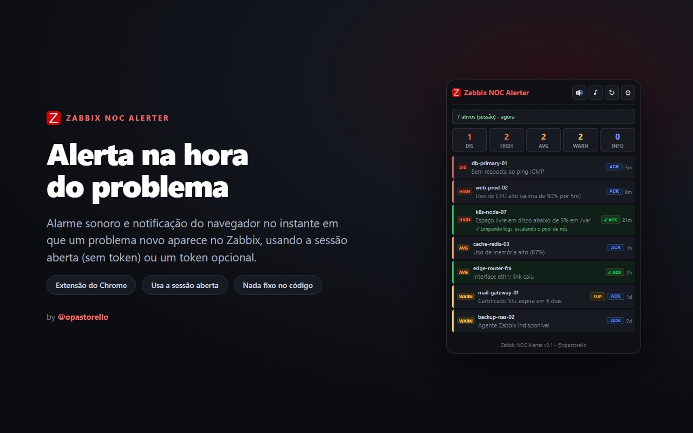
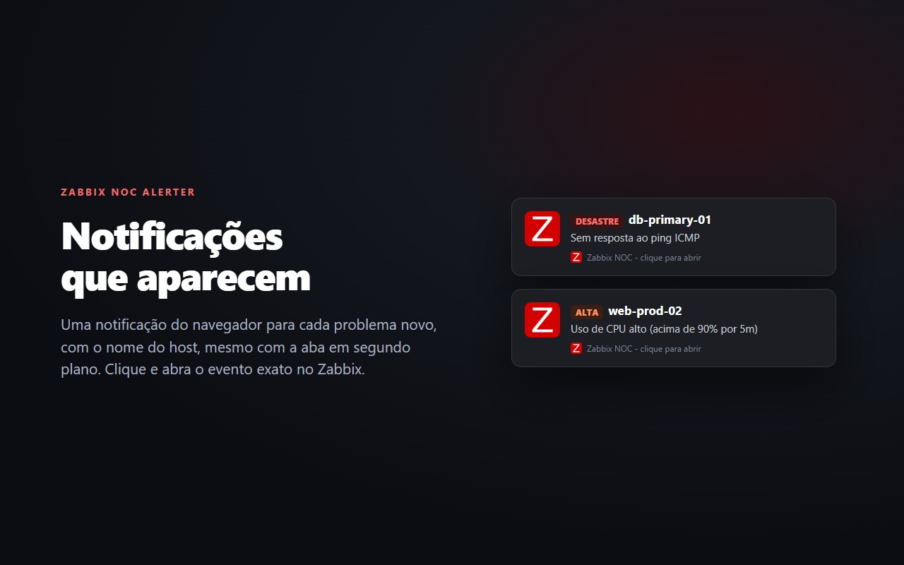
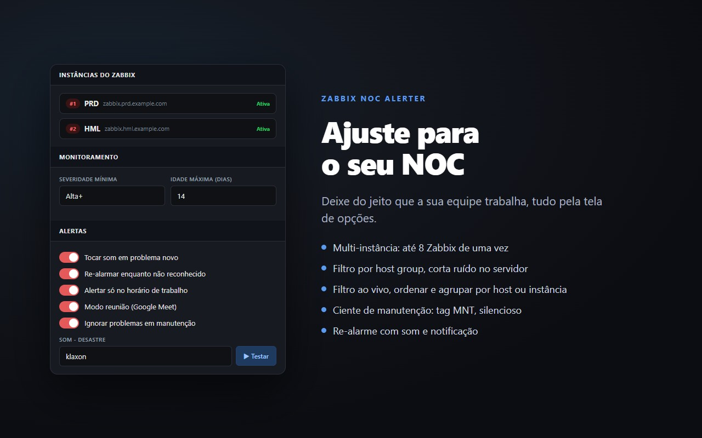
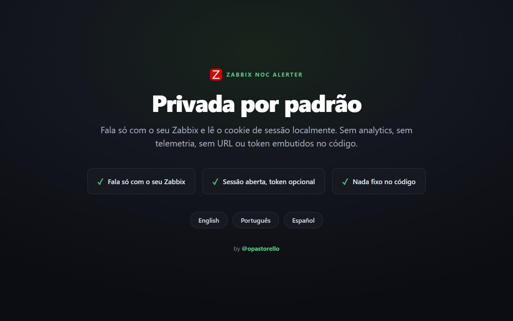

<h1 align="center">🔔 Zabbix NOC Alerter</h1>

  Um <b>alarme sonoro e notificação</b> do navegador no instante em que um <b>problema novo</b> 
  aparece no Zabbix, usando a sessão em que você <b>já está logado</b>. Sem token, nada hardcoded.

  <a href="README.md">English</a> ·
  <b>Português</b> ·
  <a href="README.es.md">Español</a>

  
  
  
  
  
  

  

Um painel que você precisa ficar olhando é fácil de perder de vista. Esta extensão
transforma um problema novo do Zabbix em algo impossível de ignorar: um som e uma
notificação, direto no navegador, enquanto você trabalha em qualquer outra coisa.

## Recursos

- 🔊 **Som por severidade** com volume e botão de teste.
- 🔁 **Re-alarme** (som e notificação) enquanto houver problema não reconhecido, até dar ack ou mudo.
- 🛠️ **Ciente de manutenção:** problemas em janela de manutenção ganham a tag MNT e ficam silenciosos (ou você esconde).
- 🔍 **Filtro ao vivo** no popup por host ou nome do problema.
- 🖥️ **Mostra o host** na lista e na notificação.
- ✅ **Ack direto do popup** (com mensagem) e mostra o ack existente.
- 🟢 **Notificação de resolvido** quando um problema recupera.
- 🖱️ **Clique no problema** abre o evento exato no Zabbix.
- 🔎 **Filtros:** severidade mínima, idade máxima, excluir por texto, esconder suprimidos/ackados/em manutenção; badge "não vistos" opcional.
- 🌐 **Idiomas:** English, Português, Español, escolhido automaticamente pelo navegador.
- 🔒 **Nada hardcoded:** a URL do Zabbix (e um token opcional) ficam só nas opções.

## Instalação

### Pela Chrome Web Store (recomendado)

[**Instalar o Zabbix NOC Alerter**](https://chromewebstore.google.com/detail/zabbix-noc-alerter/nlbihmhpbdfhnglclecbaebnfpjbngep) - um clique, com atualizações automáticas. Depois abra as **opções** da extensão, informe a URL do seu Zabbix e mantenha uma aba do Zabbix logada. É só isso.

### A partir do código (unpacked)

1. Baixe o [release](https://github.com/opastorello/zabbix-noc-alerter/releases/latest) mais recente e descompacte (ou clone este repositório).
2. Abra `chrome://extensions`, ligue o **Developer mode**, clique em **Load unpacked** e selecione a pasta.
3. Abra as **opções** da extensão e informe a URL do seu Zabbix.
4. Mantenha uma aba do Zabbix logada. É só isso.

## Como funciona

A extensão lê o cookie de sessão da aba do Zabbix em que você já está logado e
consulta a API por problemas ativos. Um problema novo toca um som e sobe uma
notificação. Token não é necessário; se a sua versão não aceitar a sessão do
frontend para escrita (ack), defina um token de API nas opções como alternativa.

**Compatibilidade:** testado no Zabbix 6.0 a 7.4 (a sessão do frontend e todas as chamadas de API funcionam). O Zabbix 8.0 será validado quando sair em versão estável.

## Privacidade

Só fala com **o seu Zabbix** (a URL que você configurou) e lê o cookie de sessão
localmente. Sem analytics, sem telemetria, sem URL ou token embutidos no código.

## Capturas de tela

  
    
  
    
  

## Contribuindo

Issues e pull requests são bem-vindos, em especial novas traduções. Veja
[CONTRIBUTING.md](CONTRIBUTING.md).

## Licença

[MIT](LICENSE) © Nicolas Pastorello ([@opastorello](https://github.com/opastorello))
